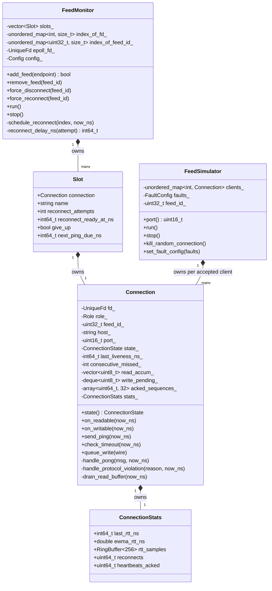
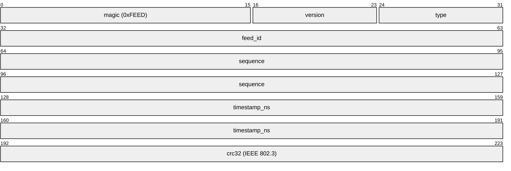
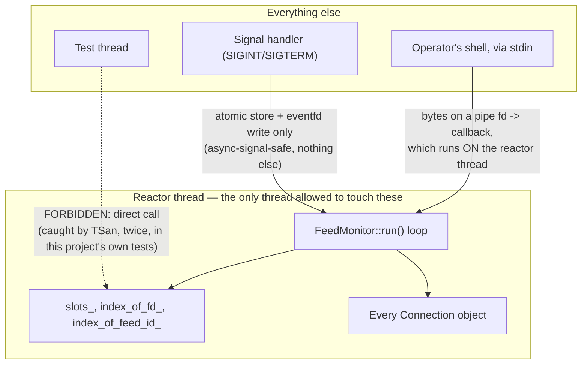
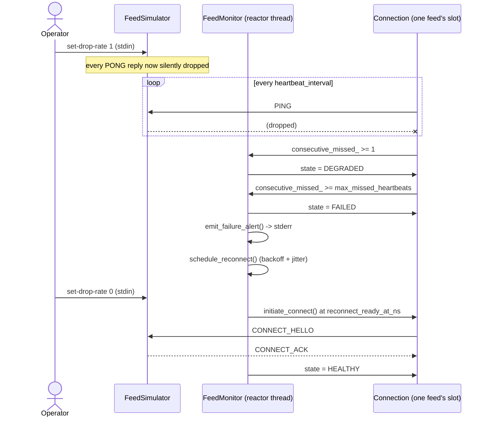
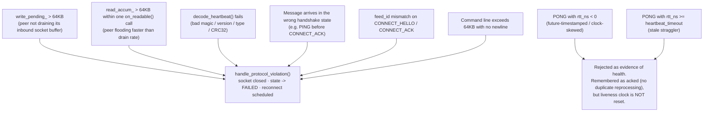
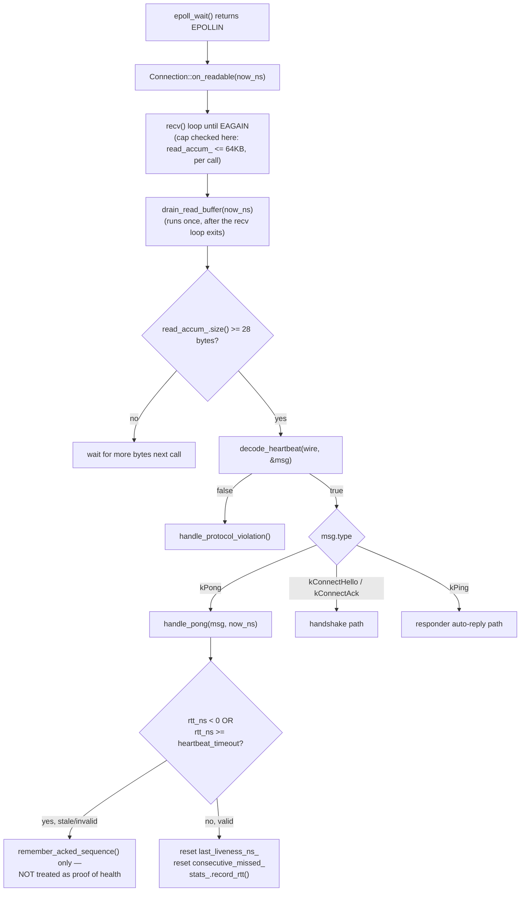

# Vigil — Architecture

A deep-reference companion to [`README.md`](README.md). Where the README makes the case for the system, this file is the engineering reference: the structural relationships, the concurrency contract, and the failure paths that a reader would otherwise have to reconstruct from the source.

> Diagrams are standard Mermaid, with one exception: the packet layout diagram uses `packet-beta`, a newer diagram type. GitHub and VS Code's built-in preview both render it as of 2024+; an older renderer will show raw text for that one block.

---

## Table of contents

- [Design philosophy](#design-philosophy)
- [Component responsibilities](#component-responsibilities)
- [The concurrency contract](#the-concurrency-contract)
- [Bounded-everything memory model](#bounded-everything-memory-model)
- [Reconnection: backoff and jitter](#reconnection-backoff-and-jitter)
- [Diagrams](#diagrams)
  1. [Class diagram](#1-class-diagram)
  2. [Wire packet layout](#2-wire-packet-layout)
  3. [Concurrency ownership](#3-concurrency-ownership)
  4. [Fault-scenario sequence](#4-fault-scenario-sequence)
  5. [Fault tree](#5-fault-tree)
  6. [Call graph — one byte's journey](#6-call-graph--one-bytes-journey)

---

## Design philosophy

Three decisions shape everything else in this codebase.

**One reactor thread, not a thread pool.** `FeedMonitor` runs a single `epoll_wait()` loop that owns every `Connection` it monitors. This is the direct answer to the measured result in the README: a thread-per-connection design pays real, growing OS-scheduling overhead as connection count climbs, while an event-driven reactor's cost stays close to flat. The cost of that choice is the concurrency contract below — everything touching reactor state must happen on that one thread, with no exceptions.

**Fixed-size, checksummed wire messages.** Every heartbeat-protocol message is exactly 28 bytes. This removes an entire class of parsing bugs: there is no length-prefix logic, no delimiter scanning, no partial-message state machine beyond "accumulate until 28 bytes, then decode." The trade-off is protocol inflexibility, accepted deliberately for a protocol that only ever needs five message kinds.

**Trust is a state machine, not a socket property.** A half-open TCP connection is indistinguishable from a healthy one at the socket-API level. Every connection's actual trust level lives in `ConnectionState`, driven entirely by heartbeat timing, and is treated as more authoritative than what the kernel reports about the underlying file descriptor.

## Component responsibilities

| Component | Owns | Does not do |
|---|---|---|
| `Connection` | One TCP socket, its read/write buffers, its protocol state, its own liveness clock | Has no notion of other feeds; does not decide reconnect policy |
| `FeedMonitor` | The `epoll` reactor loop, one `Slot` (and therefore one `Connection`) per feed, reconnect scheduling, alerting | Does not implement the wire protocol itself — delegates entirely to `Connection` |
| `FeedSimulator` | A test/demo double standing in for a real exchange — a real `epoll` server accepting client connections, with injectable faults | Not part of the production monitor; exists so the monitor can be tested against real sockets without a real exchange |
| `Stats` / `ConnectionStats` | RTT tracking (min/max/EWMA/percentile ring buffer), missed-heartbeat and reconnect counters | Has no notion of a "feed" or "connection" — a dependency-free leaf module, deliberately |
| `Config` | Parsed, validated CLI/config-file values, every numeric field range-checked at parse time | — |

## The concurrency contract

Nothing outside the reactor thread may touch reactor-owned state directly. `FeedMonitor`'s slot storage, its fd/feed-id lookup tables, and every `Connection` object are only safe to mutate from inside `FeedMonitor::run()`'s own call stack. An operator's commands reach the reactor through a dedicated pipe, processed by a callback that itself runs *on* the reactor thread when the pipe becomes readable — never a cross-thread call in disguise.

This rule was violated twice by this project's own test code during development — never in production code — and caught both times by ThreadSanitizer. [Diagram 3](#3-concurrency-ownership) is the rule that would have prevented either mistake from being written.

## Bounded-everything memory model

Every buffer that grows from network input has an explicit cap, and every cap failure has the same outcome: fail the connection cleanly rather than let something grow without bound, or silently drop bytes mid-message — which would desync a byte-oriented protocol far worse than tearing the connection down. Inbound and outbound buffers are each capped at 64KB; an unterminated command line is capped the same way. [Diagram 5](#5-fault-tree) catalogs every trigger and outcome in one place.

## Reconnection: backoff and jitter

A failed connection's next attempt is scheduled at `min(base_delay × 2^attempt, max_delay)`, then jittered by ±25%. The jitter exists for one specific reason: without it, many feeds failing at once — a correlated event, such as the upstream exchange itself blipping — would retry in lockstep, hammering the far end with a synchronized reconnect storm at the exact moment it's recovering.

---

## Diagrams

### 1. Class diagram

The real member fields and methods of the three core classes, and the ownership relationships between them. `Connection` is deliberately unaware of anything beyond its own socket; all multi-feed bookkeeping lives one level up, in `FeedMonitor`.

**In plain terms:** `Connection` handles one socket's entire conversation on its own. `Slot` is just a `Connection` plus some retry bookkeeping (how many attempts so far, when to try again). `FeedMonitor` holds one `Slot` per feed it's watching. `FeedSimulator` is a separate, unrelated class — it plays the role of the exchange during testing, not the monitor's side of the conversation.

---

### 2. Wire packet layout

The exact byte layout of the fixed 28-byte `HeartbeatMessage`. The protocol's simplicity rests on this being fixed-size with no padding — enforced by a `static_assert` in `heartbeat.h` itself, not just asserted here.

**In plain terms:** every message sent between the monitor and a feed is exactly the same 28 bytes, in exactly the same order, every single time. There's no guessing where one field ends and the next begins, and no way for the two sides to lose sync about how to read a message.

---

### 3. Concurrency ownership

Who may touch reactor state, and how everyone else has to ask.

**In plain terms:** only the reactor's own loop is ever allowed to change a connection's state. A test thread, a signal, or an operator typing a command can't reach in and change something directly — they can only leave a message for the reactor to act on when it's ready, which is what actually keeps this safe with no locks.

---

### 4. Fault-scenario sequence

A complete fault-and-recovery cycle across all four actors at once — the shape of the actual integration tests in `feed_monitor_test.cpp`, where the interesting bugs live in component interaction rather than inside any single component.

**In plain terms:** this is the same failure-and-recovery story as the state-machine diagram in the README, but zoomed out to show all four participants — the operator, the fake exchange, the reactor, and one connection — talking to each other, instead of just one connection's internal states in isolation.

---

### 5. Fault tree

Every path that leads to `handle_protocol_violation()` — the single chokepoint that fails a connection — alongside the one adjacent case that's rejected without tearing the connection down. Each of these was a real, empirically-reproduced bug before it was a line in this diagram.

**In plain terms:** every box on the left is a different way a connection can misbehave — flooding, going quiet mid-handshake, sending garbage, replying too late. No matter which one happens, the outcome is the same: the connection is closed cleanly and retried, never left sitting in a broken, half-trusted state.

---

### 6. Call graph — one byte's journey

The function-call path from `epoll_wait()` returning a readable event through to a PONG either updating a connection's liveness or being rejected. This is the path every Tier-1 hardening fix sits on — the `read_accum_` cap has to be checked *inside* the recv loop rather than only after `drain_read_buffer()` runs, because an unbounded number of `recv()` calls could already have appended to the buffer within a single `on_readable()` invocation by the time control reaches it.

**In plain terms:** this is the exact path one incoming network message takes, from the moment the operating system says "data is ready to read" to the moment it either updates the connection's health or gets thrown out as invalid. Nothing about a message is trusted until it's passed every check on this path.
