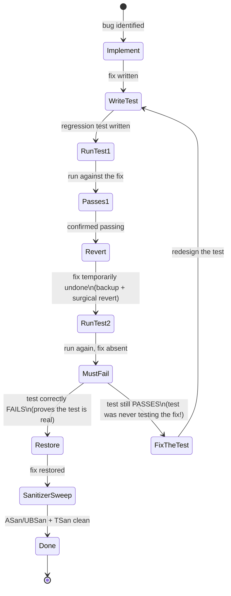
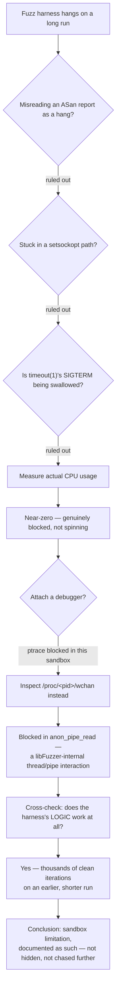
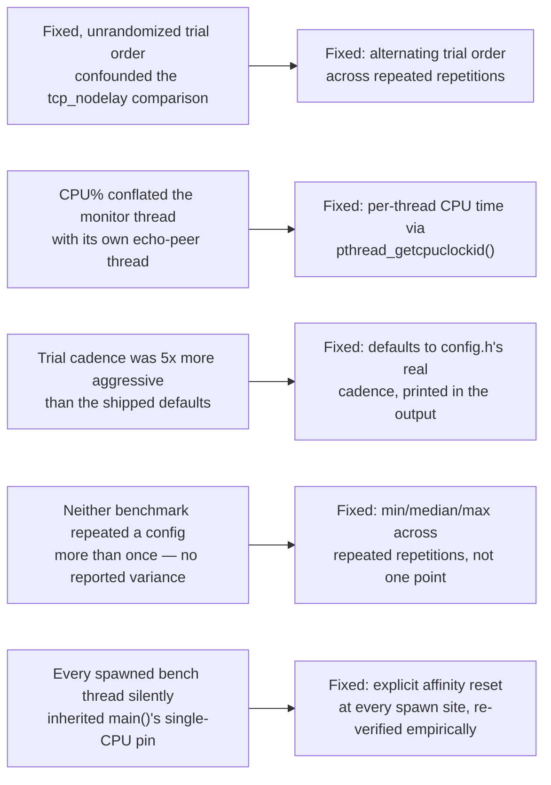
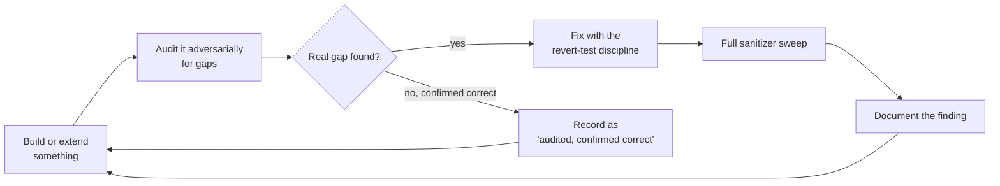

# Vigil — Methodology

A companion to [`ARCHITECTURE.md`](ARCHITECTURE.md) (system structure) and [`README.md`](README.md) (the pitch). This file documents a different axis: **how** this codebase was built and verified, not what it is.

---

## Table of contents

- [The core discipline: revert-test, not trust-test](#the-core-discipline-revert-test-not-trust-test)
- [Multiple independent verification layers](#multiple-independent-verification-layers)
- [Diagrams](#diagrams)
  1. [The revert-test discipline](#1-the-revert-test-discipline)
  2. [Root-cause diagnosis: a case study](#2-root-cause-diagnosis-a-case-study)
  3. [Verification matrix](#3-verification-matrix)
  4. [Benchmark methodology timeline](#4-benchmark-methodology-timeline)
  5. [The audit-pass cycle](#5-the-audit-pass-cycle)

---

## The core discipline: revert-test, not trust-test

The easiest way for a regression test to lie is to pass for the wrong reason — testing something adjacent to the actual fix, or passing regardless of whether the fix exists at all. Every fix in this project's history was held to a stricter bar than "write a test, watch it pass": implement the fix, write the regression test, confirm it passes, temporarily revert *only* the fix, confirm the test now fails, restore the fix, confirm green again. A test that can't fail is not a test.

This caught its own share of process bugs, not just code bugs. A `read_accum_`-cap regression test's first draft passed even with the fix reverted, because a pre-existing corrupt-message check was masking the thing the new cap was supposed to catch — exactly the failure mode the revert step exists to surface.

## Multiple independent verification layers

No single technique here is trusted to catch everything, because none of them can. Manual audit finds different bugs than a static analyzer; a static analyzer finds different bugs than a race detector; a race detector finds different bugs than a fresh pair of eyes with no prior context. This project layers all of them rather than picking one:

| Layer | What it caught here |
|---|---|
| Manual audit against claimed behavior | A stale PONG accepted as proof of health, despite the connection having missed real heartbeats after it was sent |
| `clang-tidy` | Raw `atoi`/`atof` silently returning 0 on unparseable CLI input instead of signaling an error |
| ThreadSanitizer | Two genuine data races in this project's own test code — never in production paths |
| A fresh-eyes review with no prior context | A CPU-affinity-inheritance bug that had silently been contaminating benchmark numbers |
| Empirical diagnosis (a hand-built, deliberately malformed input) | A future-timestamped PONG producing a negative RTT and being accepted anyway |

Every one of these was verified independently before being trusted — a static-analysis finding was read in its original context and confirmed real or dismissed with a documented reason, never fixed or ignored on the tool's word alone.

---

## Diagrams

### 1. The revert-test discipline

The lifecycle every bug fix in this project went through, as a state diagram rather than a linear checklist — the revert step is a genuine branch point, not a formality.

**In plain terms:** a bug fix isn't considered finished the moment its test passes. The test also has to be proven capable of *failing* — by temporarily undoing the fix and checking the test actually catches that. A test that would pass either way isn't really testing anything.

---

### 2. Root-cause diagnosis: a case study

One specific investigation, traced step by step: why a fuzz harness hung on long automated runs in this sandbox, while its logic had already been confirmed correct on a shorter run. A template for how an inconclusive result gets resolved here — rule out possibilities one at a time with whatever tooling is actually available, and know when to stop and document a limitation honestly rather than chase an environment quirk indefinitely.

**In plain terms:** rather than guessing at the cause, each possible explanation was ruled out one at a time using real evidence, and the investigation stopped at an honest, written-down conclusion instead of an assumption — including admitting the limit of what could be diagnosed in this particular environment.

---

### 3. Verification matrix

Which build variant actually ran against which category of check — a grid of checkmarks reads more honestly as a table than forced into a diagram.

| Build variant | Unit + integration tests | Benchmarks | Fuzzing | Coverage |
|---|---|---|---|---|
| Plain (`g++ -O2`) | ✅ | ✅ | — | — |
| ASan + UBSan | ✅ | ✅ | — | — |
| ThreadSanitizer | ✅ | ✅ | — | — |
| `clang++` (second compiler) | ✅ | — | ✅ | — |
| `g++ --coverage -O0` | ✅ | — | — | ✅ |

Fuzzing, notably, only ever ran under `clang++ -fsanitize=fuzzer,address` — never under ThreadSanitizer or plain `g++` — a specific, known boundary rather than an assumption.

**In plain terms:** this table is a plain accounting of exactly which safety checks ran on exactly which version of the build. Nothing here is claimed to have been tested that actually wasn't — including the gaps, like fuzzing never running under the race detector.

---

### 4. Benchmark methodology timeline

The benchmarking tools' own bug history. A benchmark that measures the wrong thing is worse than no benchmark — it produces a confident, specific, wrong number. Every fix below is cited directly in `bench/`'s own source comments.

**In plain terms:** the code that *measures* performance was audited and fixed just as seriously as the code being measured. A benchmark that quietly measures the wrong thing is worse than having no benchmark at all — it hands you a confident, specific, wrong number instead of an honest "we don't know."

---

### 5. The audit-pass cycle

The repeating shape behind this project's history past its initial build — not a straight line to "done," but a loop that kept finding real things to fix. This is the honest structural description of how the codebase got this far: not by getting everything right the first time, but by never treating a clean run as proof there was nothing left to find.

**In plain terms:** this project wasn't built once and declared finished. It was built, checked for gaps, fixed, and checked again — repeatedly — and even the passes that found nothing wrong were written down as a deliberate result, not silently skipped.
