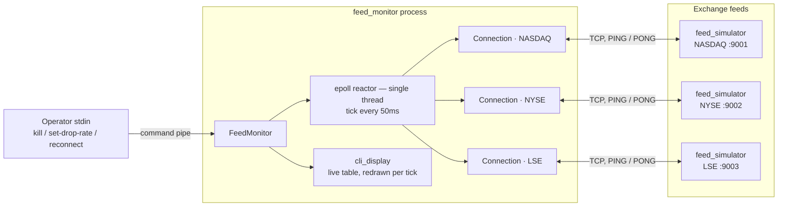
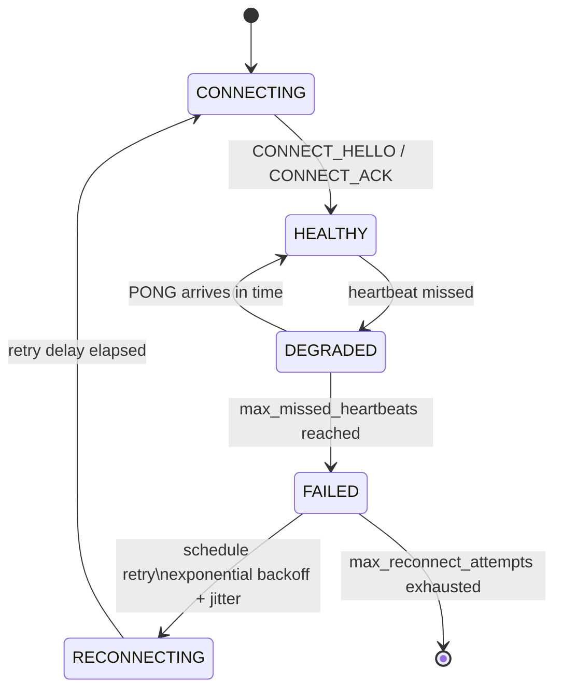
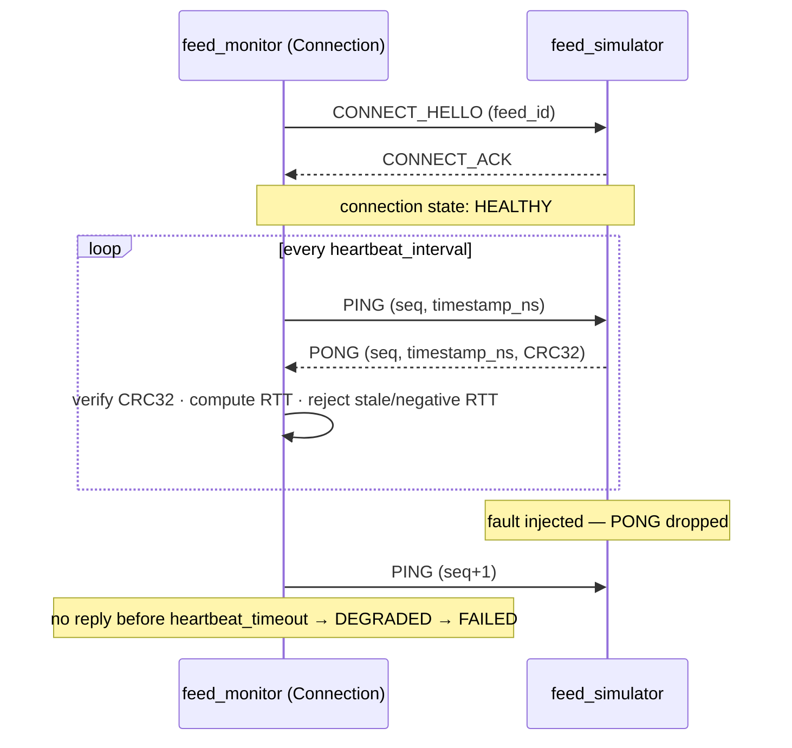
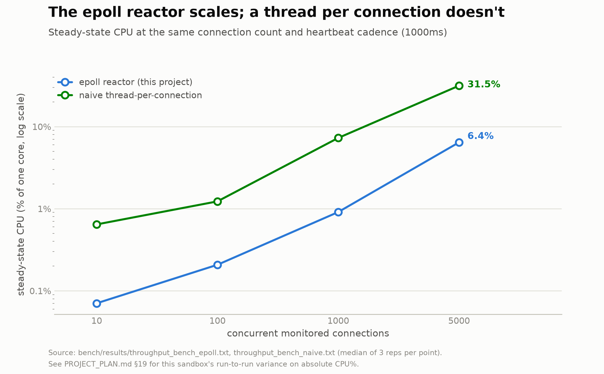
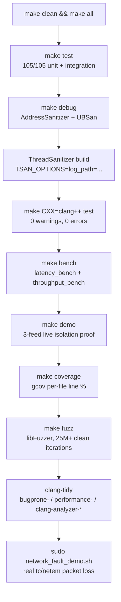
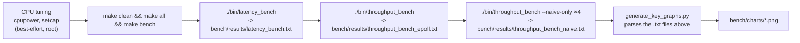

# Vigil — Low-Latency TCP Heartbeat Monitor

**A single-threaded `epoll` reactor for market-data feed liveness detection — sub-10µs heartbeat round trips, 5,000+ concurrently monitored feeds on one core, automatic detect → degrade → fail → reconnect with zero operator intervention.**

Built for the exact problem every market-data gateway has: a feed connection can go silent — network partition, upstream stall, half-open TCP state — without ever sending a `FIN`. TCP alone will not tell you your feed is dead. This project is the heartbeat layer that does.

---

## Table of contents

- [Why this exists](#why-this-exists)
- [Architecture](#architecture)
- [Connection lifecycle (state machine)](#connection-lifecycle-state-machine)
- [Wire protocol](#wire-protocol)
- [Performance](#performance)
- [Benchmarks](#benchmarks)
- [Quick start](#quick-start)
- [Build & verification pipeline](#build--verification-pipeline)
- [Reproducing the benchmarks](#reproducing-the-benchmarks)
- [Real network-layer fault injection](#real-network-layer-fault-injection)
- [Project layout](#project-layout)
- [Correctness rigor](#correctness-rigor)
- [Deliberate scope boundaries](#deliberate-scope-boundaries)

---

## Why this exists

A market-data feed handler's failure mode is rarely a clean disconnect. A half-open TCP session — the kind produced by a dead upstream process, a silently dropped NAT/firewall mapping, or a partitioned network segment — leaves the socket looking perfectly healthy to the kernel while no data has moved in minutes. Downstream consumers (order books, pricing engines, risk systems) keep trusting stale state until something else notices.

The fix is a heartbeat protocol enforced above TCP: **if I haven't heard from you inside `heartbeat_timeout`, I stop trusting you — regardless of what the socket claims.** This project implements exactly that, plus the operational half most heartbeat write-ups skip: automatic reconnection with exponential backoff and jitter (so a correlated failure across many feeds doesn't thundering-herd the reconnect), fault isolation between feeds, and a verification standard (105 tests, three sanitizers, fuzzing, real kernel-level packet loss injection) appropriate to code that a trading system would actually depend on.

## Architecture

One process, one `epoll` reactor thread, one `Connection` object per monitored feed. An operator's commands arrive through a dedicated pipe rather than mutating reactor state from another thread — every state change happens on the reactor thread, always.



**What this shows, in plain terms:** one program (`feed_monitor`) watches several exchange feeds at once. It doesn't spin up a separate worker for each feed — one loop handles all of them, checking in on whichever ones need attention. An operator can type commands into that same program to simulate or clear a fault. Why one loop instead of one worker per feed: see [Performance](#performance) — the gap is not cosmetic, it's the difference between watching 5,000 feeds on 6% of one CPU core versus 31%+ of one.

## Connection lifecycle (state machine)

Every connection's trust level lives entirely in this state machine. A missed heartbeat degrades trust immediately; enough consecutive misses fails the connection and hands it to the reconnect path, which backs off exponentially with jitter — so a correlated multi-feed failure doesn't retry-storm the exchange.



**What this shows, in plain terms:** a feed starts out `CONNECTING`, becomes `HEALTHY` once the handshake finishes, and stays there as long as heartbeats keep arriving on time. One missed heartbeat is just a warning (`DEGRADED`) — it only becomes a real failure after several misses in a row. Once failed, the monitor waits a bit (longer each time it fails again, with some randomness mixed in) before trying to reconnect on its own, with no operator needing to intervene.

## Wire protocol

Every message is a fixed 28-byte, big-endian, CRC32-checksummed frame — no variable-length parsing, no ambiguity about desync. A stale or future-timestamped PONG is rejected outright rather than accepted as evidence of health, and every buffer involved is capped, so a stalled or flooding peer fails cleanly instead of growing memory without bound.



**What this shows, in plain terms:** first a one-time handshake ("hello" / "acknowledged"), then a repeating "are you there?" / "yes" exchange for as long as the connection lives. The bottom half shows what happens when a reply stops arriving: the monitor doesn't wait forever — once the reply is late enough, it stops trusting the connection.

## Performance

Two numbers matter for a feed monitor: **is the heartbeat itself fast enough to be invisible**, and **does the architecture actually scale to a real feed count**. Both are measured against real sockets over loopback, not simulated.

### The heartbeat round trip stays single-digit microseconds


**What this shows, in plain terms:** how long it takes for a "PING" to get a "PONG" back, measured tens of thousands of times so a few unlucky slow ones don't skew the picture. Every bar is comfortably under 10 microseconds — for reference, that's about a thousand times faster than a typical human eye-blink.

20,000 measured PING → PONG round trips × 5 repetitions per configuration, trial order alternated to cancel CPU-frequency-warmup bias. p50 sits at ~6.1µs, p99 at ~7.5µs — a tight tail, which is what actually matters for a timeout-driven system: a fat tail here means false failure detections on a perfectly healthy feed. For scale, a real WAN network round trip is typically 10,000–50,000µs; this software's own processing overhead is 1,000–8,000x smaller than the network delay it will actually be riding on top of in production. `tcp_nodelay=true` and `false` come out statistically indistinguishable here — expected, not a bug: this benchmark's strict send-then-wait pattern never gives Nagle's algorithm a second queued write to hold back either way.

### The epoll reactor scales; a thread per connection doesn't



**What this shows, in plain terms:** the same job (watching a growing number of feeds) done two different ways. The blue line (this project's actual design) barely climbs as the feed count grows into the thousands. The green line (a "worker thread per feed" design) climbs much faster — by 5,000 feeds it's using nearly 5x more CPU for the exact same work.

This is the architectural case for the whole design. At 5,000 concurrently monitored connections, the `epoll` reactor uses a few percent of one core; a naive one-OS-thread-per-connection design costs several times more, and the gap widens as connection count climbs — the textbook C10K result, reproduced with real measured data instead of asserted from a blog post. This is the reason a single-threaded reactor, not a thread pool, is the right architecture for watching thousands of feeds.

> **On absolute numbers:** this machine is a shared/virtualized sandbox with no guaranteed CPU governor or real-time scheduling privilege — repeated runs of the same benchmark showed real variance in the exact percentages (documented in `PROJECT_PLAN.md` §19). Treat the *trend* (epoll wins, the gap grows with scale) as the reliable result; treat any single absolute percentage as "measured on this machine, this run." The charts above are regenerated directly from `bench/results/*.txt` — see [Reproducing the benchmarks](#reproducing-the-benchmarks) to get a fresh, current pair.

## Benchmarks

Four separate benchmarks live in this project, each answering a different plain-language question. All four run against real TCP sockets on loopback — nothing here is simulated math.

| Benchmark | Question it answers | How to run it | Result on this machine |
|---|---|---|---|
| **Heartbeat round-trip latency** | How long does one "are you alive?" check actually take? | `./bin/latency_bench` | p50 ≈ **6.1µs**, p99 ≈ **7.4–7.5µs** — for both `tcp_nodelay` settings |
| **Connection-count scaling** | How much CPU does watching more feeds cost, with the real single-loop reactor? | `./bin/throughput_bench` | **0.07%** of one CPU core at 10 feeds → **6.4%** at 5,000 feeds |
| **Batch-size tuning** (`epoll_max_events`) | How many feeds should the reactor check per wake-up? | same binary, its batch-size sweep | **~6.3–6.9%** CPU across batch sizes 16–1024 — the batch size mostly changes how many system calls are needed to keep up, not how much CPU is burned overall |
| **Naive thread-per-connection baseline** | What would this cost *without* the single-loop design — one worker thread per feed instead? | `./bin/throughput_bench --naive-only` | **0.64%** of one CPU core at 10 feeds → **31.5%** at 5,000 feeds |

The first two rows are the ones charted above. The batch-size and naive-baseline rows are measured every run but don't get their own chart — the raw numbers are always available in `bench/results/` after running the benchmarks (see below), and the full comparison table (min/median/max, RSS, `epoll_wait`/events-per-second) lives in `PROJECT_PLAN.md` §17.1 and §19.

## Quick start

Two-terminal live simulation — one process plays the exchange, one watches it:

```bash
make all

# Terminal A — the simulated exchange feed
./bin/feed_simulator --port 9000 --feed-id 1

# Terminal B — the monitor watching it
./bin/feed_monitor --feed 1:DEMO:127.0.0.1:9000 \
    --heartbeat-interval-ms 1000 --heartbeat-timeout-ms 3000 --max-missed 3
```

Then, typed into Terminal A's stdin while both are running:

```
set-drop-rate 1      # silently drop every PONG -> watch Terminal B go HEALTHY -> DEGRADED -> FAILED
set-drop-rate 0      # stop dropping -> watch it reconnect and recover
kill                 # forcibly RST the connection -> watch the socket-error reconnect path
quit                 # clean shutdown
```

Or skip the two terminals and watch a scripted 3-feed isolation proof — one feed faulted, two others asserted to stay `HEALTHY` throughout:

```bash
make demo
./bin/lifecycle_demo
```

## Build & verification pipeline

Nothing ships on a single green run. Every change moves through plain build, both sanitizer families, a second compiler, and — separately, by hand, outside the automated chain — fuzzing, coverage, static analysis, and real kernel-level fault injection.



**What this shows, in plain terms:** every change to this project has to pass through all of these steps, in order, before it counts as done. The first few catch ordinary bugs and crashes; the sanitizer steps (ASan/UBSan/TSan) catch memory bugs and race conditions that a normal test run wouldn't notice; the last few (fuzzing, static analysis, real packet loss) are extra checks run by hand, not on every commit, because they're slower and need things (root access, a second compiler) that aren't always available.

```bash
make clean && make all && make test          # plain build + full suite
make debug                                    # ASan + UBSan
make CXXFLAGS="-std=c++20 -Wall -Wextra -Wpedantic -O1 -g -fsanitize=thread" test   # TSan
make CXX=clang++ test                         # second compiler, 0 warnings
```

## Reproducing the benchmarks

One command: CPU tuning (best-effort) → clean rebuild → run every benchmark, saving raw output into `bench/results/` → regenerate both charts above **from those saved files** — there is no hardcoded number anywhere in the chart script; `scripts/generate_key_graphs.py` parses `bench/results/*.txt` directly, so a stale chart simply can't happen silently.



**What this shows, in plain terms:** one script does the whole job — tune the machine, rebuild everything, run every benchmark, save the raw numbers to a file, then redraw the charts from those saved files. There's no step where a person has to copy a number from a terminal into a chart by hand, so a chart can never quietly go stale.

```bash
bash scripts/run_benchmarks_and_plot.sh
```

Or step by step:

```bash
sudo cpupower frequency-set -g performance          # optional, needs root
make clean && make all && make bench
sudo setcap cap_sys_nice+ep bin/latency_bench        # optional, lets SCHED_FIFO succeed
sudo setcap cap_sys_nice+ep bin/throughput_bench

mkdir -p bench/results
./bin/latency_bench 20000 500 5 | tee bench/results/latency_bench.txt
./bin/throughput_bench 10,100,1000,5000 | tee bench/results/throughput_bench_epoll.txt
{
    ./bin/throughput_bench --naive-only 10
    ./bin/throughput_bench --naive-only 100
    ./bin/throughput_bench --naive-only 1000
    ./bin/throughput_bench --naive-only 5000
} | tee bench/results/throughput_bench_naive.txt

python3 scripts/generate_key_graphs.py
```

## Real network-layer fault injection

The test suite's own fault injection (`FeedSimulator`'s `drop_probability` / `extra_latency`) is application-layer — it never touches the kernel network stack. `scripts/network_fault_demo.sh` is the complementary, lower-layer check: real `tc`/`netem` packet loss, delay, and reordering on loopback, against the actual shipped binaries, proving the heartbeat-timeout mechanism reacts correctly (and doesn't over-react to transient loss) when the *kernel*, not the application, is the one misbehaving.

```bash
sudo ./scripts/network_fault_demo.sh
# 5 phases: baseline -> 40% loss -> 100% loss -> recovery -> 300ms delay + 25% reorder
# Tears the qdisc down unconditionally on exit/Ctrl-C.
```

Needs root (`CAP_NET_ADMIN` for `tc qdisc`); deliberately not part of `make test` or any CI, since mutating a network interface's queueing discipline shouldn't happen silently as a side effect of a normal test run.

## Project layout

```
src/            Connection, FeedMonitor, FeedSimulator, wire protocol, CLI display, config
test/           105 unit + integration tests, incl. real-binary end-to-end tests
bench/          latency_bench, throughput_bench, saved results/, generated charts/
demo/           lifecycle_demo — scripted 3-feed live isolation proof
fuzz/           libFuzzer harnesses: decode_heartbeat, drain_read_buffer
scripts/        network_fault_demo.sh, run_benchmarks_and_plot.sh, generate_key_graphs.py
PROJECT_PLAN.md Full build history, every audit pass, every bug found and fixed
```

## Correctness rigor

A feed monitor that silently corrupts memory or races on shared state is worse than useless in front of a trading system — it's a new failure mode wearing a monitoring tool's clothes. This project is held to that bar:

| Check | Result |
|---|---|
| Unit + integration tests | **105/105** passing |
| AddressSanitizer + UndefinedBehaviorSanitizer | clean |
| ThreadSanitizer | clean (2 genuine races found and fixed during development — both in test code, not production paths) |
| Second compiler (`clang++`) | 0 warnings, 0 errors |
| Fuzzing (libFuzzer) | 25M+ iterations against the wire-protocol decoder, 0 crashes |
| Static analysis (`clang-tidy`) | every finding triaged by hand; genuine issues fixed, false positives documented with reasoning |
| Line coverage (`gcov`) | measured per-file, gaps triaged as structurally unreachable or covered via the e2e binary tests |
| Real kernel-level fault injection | `tc`/`netem` packet loss/delay/reorder against the shipped binaries |

Full history of every bug found, every fix, and every verification pass is in [`PROJECT_PLAN.md`](PROJECT_PLAN.md).

## Deliberate scope boundaries

Explicitly out of scope, and documented as a decision rather than an oversight:

- **No wire encryption / authentication** — CRC32 detects accidental corruption, not tampering by a deliberate adversary; the wire protocol's `version` field is the extension point if this is ever revisited.
- **No persistent history / alerting integration** — `stderr`-only logging by design; log rotation and alert routing are conventionally an external concern (`logrotate`, a supervisor, a real paging system), not this project's.
- **No CI pipeline** — no git remote exists for this project yet; a deliberate, documented gap, not a silent one.
- **No kernel bypass (DPDK / io_uring busy-poll)** — this project targets standard `epoll` + kernel TCP; a kernel-bypass rewrite is a different project with a different architecture, and provides zero benefit on loopback, where all of this project's own testing runs.
- **IPv4 loopback / hostnames only** — no IPv6, no DNS resolution in the feed config.
